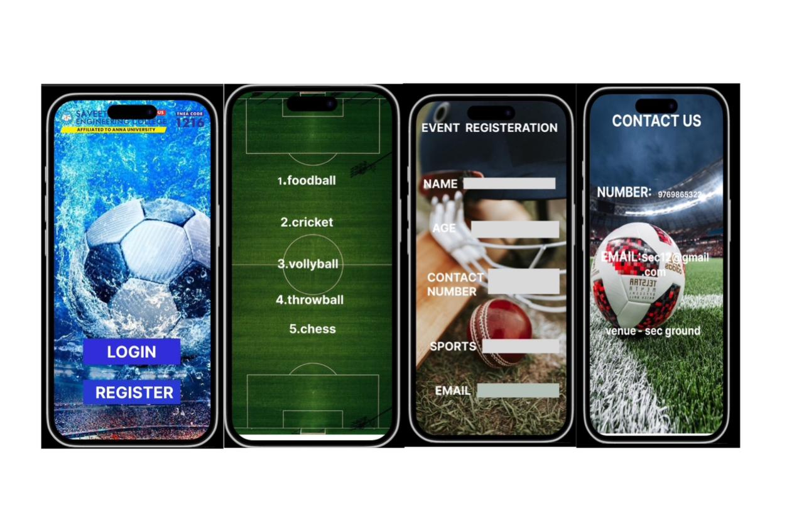

# Ex09 Event Registration Web Application
## Date:15/10/2025

## AIM:
To design, develop and deploy a web application for event registration.

## DESIGN STEPS:

### Step 1:
Create a new frame.

### Step 2:
Select any one preset size of your choice.

### Step 3:
Select the shapes you need.

### Step 4:
Import images as needed.

### Step 5:
Create pages based on your need and link them.

### Step 6:

Validate the HTML and CSS code.

### Step 6:

Publish the website in the given URL.

## DESIGN TOOL:
Figma

## CODE:

```

html
<!DOCTYPE html>
<html lang="en">
<head>
  <meta charset="UTF-8" />
  <meta name="viewport" content="width=device-width, initial-scale=1.0" />
  <title>Saveetha Sports Portal</title>
  <link rel="stylesheet" href="style.css" />
</head>
<body>
  <div class="container">
    <!-- Header -->
    <div class="header">
      
      <div class="header-text">
        <h3>SAVEETHA ENGINEERING COLLEGE</h3>
        <p>AFFILIATED TO ANNA UNIVERSITY</p>
      </div>
      <div class="codes">
        <span class="autonomous">AUTONOMOUS</span>
        <span class="tnea">TNEA CODE: 1216</span>
      </div>
    </div>

    <!-- Main content -->
    <div class="main">
      

      <div class="buttons">
        <a href="#" class="btn login">LOGIN</a>
        <a href="#" class="btn register">REGISTER</a>
      </div>
    </div>
  </div>
</body>
</html>


css
* {
  margin: 0;
  padding: 0;
  box-sizing: border-box;
  font-family: 'Poppins', sans-serif;
}

body {
  background: url('stadium-bg.jpg') no-repeat center center/cover;
  height: 100vh;
  display: flex;
  align-items: center;
  justify-content: center;
}

.container {
  width: 320px;
  height: 600px;
  border-radius: 20px;
  overflow: hidden;
  position: relative;
  background: linear-gradient(to bottom, rgba(0,0,0,0.4), rgba(0,0,0,0.6)),
              url('water-football-bg.jpg') center/cover;
  color: #fff;
}

/* Header Section */
.header {
  text-align: center;
  padding: 10px 0;
  background: rgba(255,255,255,0.15);
}

.logo {
  width: 60px;
}

.header-text h3 {
  font-size: 14px;
  font-weight: 700;
  margin-top: 5px;
}

.header-text p {
  font-size: 10px;
}

.codes {
  font-size: 10px;
  margin-top: 3px;
}

.autonomous {
  background: red;
  padding: 2px 4px;
  border-radius: 3px;
  color: white;
  font-weight: 600;
}

.tnea {
  background: #1e3cff;
  padding: 2px 4px;
  border-radius: 3px;
  margin-left: 4px;
}

/* Main Image */
.main {
  display: flex;
  flex-direction: column;
  align-items: center;
  margin-top: 30px;
}

.football {
  width: 220px;
  height: auto;
  border-radius: 50%;
  animation: bounce 3s infinite ease-in-out;
}

@keyframes bounce {
  0%, 100% { transform: translateY(0); }
  50% { transform: translateY(-15px); }
}

/* Buttons */
.buttons {
  position: absolute;
  bottom: 50px;
  display: flex;
  flex-direction: column;
  gap: 15px;
  width: 100%;
  align-items: center;
}

.btn {
  text-decoration: none;
  color: white;
  background: #2539f8;
  width: 200px;
  text-align: center;
  padding: 10px;
  border-radius: 8px;
  font-weight: 700;
  transition: 0.3s;
}

.btn:hover {
  background: #1b2dd1;
}

.register {
  background: #1b2dd1;
}


```


## OUTPUT:



## RESULT:
The program to design, develop and deploy a web application for event registration is completed successfully.
